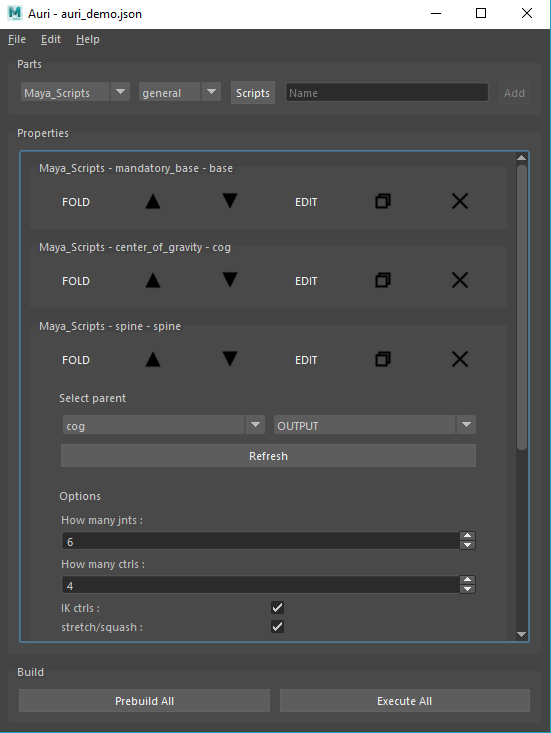

# Auri
Auri is a modular python script launcher.
The main idea is to build a library of scripts (we call them *modules*) and have a shell (*Auri*) executing the stacked scripts (we call it the *stack*) in a top to bottom order.

Auri is confirmed to work on Modo, Maya, Houdini, Nuke and as a standalone application.

# How it works
The `scripts` folder contains *categories* and *subcategories* (subfolders) which contain *modules* (python scripts).
Auri lets you select a category, a subcategory and a corresponding script and *add* it to the list of scripts to execute.

A module can have a custom UI (view) and logic associated to it.

You can save & load the stack and its settings in order to reuse and share it with your team.

# Modules Examples
[Maya 2017 Rigging Modules](https://github.com/Sookhaal/auri_maya_rigging_scripts)

# Who is using it?
Auri was used at [ArtFX](https://artfx.school/en/) for the 5th year's graduation projects (2018) for the rigging process.
It was also used for Mercand, an Unreal Engine 4 video game.

